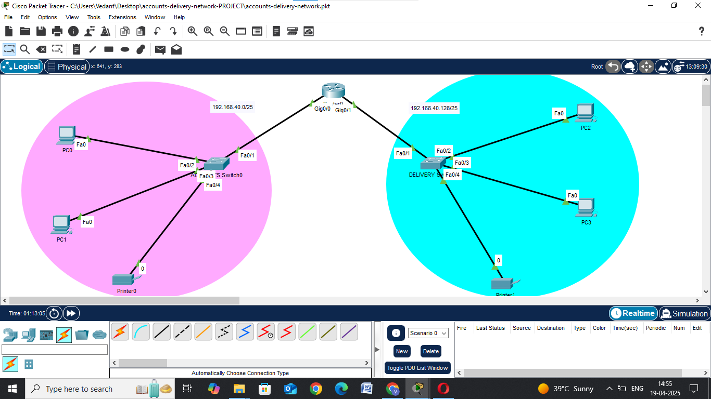
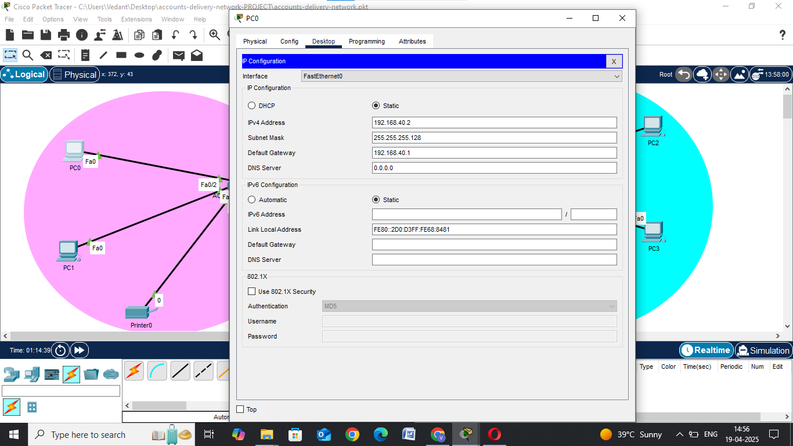
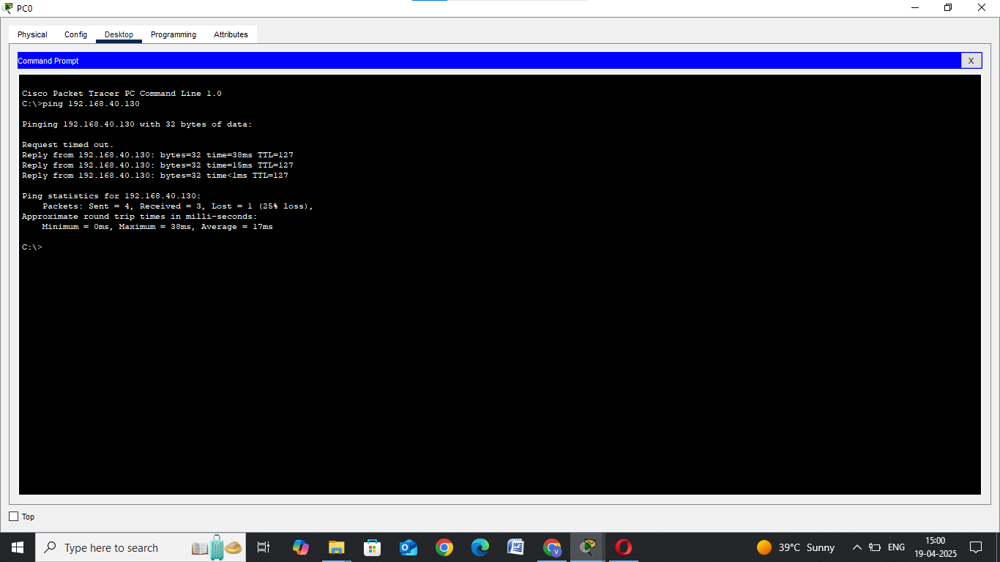

# PROBLEM STATMENT
Design a network in CISCO packet tracer to connect ACCOUNTS and DELIVERY departments through the following: [40 points]
a. Each department should contain at least 2 PCs.
b. Appropriate number of switches and routers should be used in the network.
c. Using the given network address 192.168.40.0, all interfaces should be configured with appropriate IP addresses, subnet mask and gateways.
d. All devices in the network should be connected using appropriate cables.
e. Test the connectivity between ACCOUNTS and DELIVERY department -PCs in DELIVERY department should be able to ping the PCs in ACCOUNTS department

_________________________________________________________________________________________________________________________________________________________________________________________________________________

# Accounts and Delivery Department Network Design

## 📌 Objective
Connect two departments using Cisco Packet Tracer. Assign IP addresses, connect PCs, switches, and routers, and test communication using ping.

## 🛠 Tools Used
- Cisco Packet Tracer

## 🌐 Network Address
192.168.40.0/24 (divided into 2 subnets)

## 📐 Subnetting Plan
- Accounts: 192.168.40.0/25  
- Delivery: 192.168.40.128/25

## 💻 Devices Used
- 4 PCs (2 in each department)
- 2 Switches
- 1 Router
- 2 printer (1 in each department)

## 🌐 IP Address Table

| Device | IP Address | Subnet Mask | Default Gateway |
|--------|------------|-------------|-----------------|
| PC0 (Accounts) | 192.168.40.2 | 255.255.255.128 | 192.168.40.1 |
| PC1 (Accounts) | 192.168.40.3 | 255.255.255.128 | 192.168.40.1 |
| PC2 (Delivery) | 192.168.40.130 | 255.255.255.128 | 192.168.40.129 |
| PC3 (Delivery) | 192.168.40.131 | 255.255.255.128 | 192.168.40.129 |

## ✅ Ping Test Result
Delivery PC successfully pinged Accounts PC. Network is working.

## 📸 Screenshots
  
  

